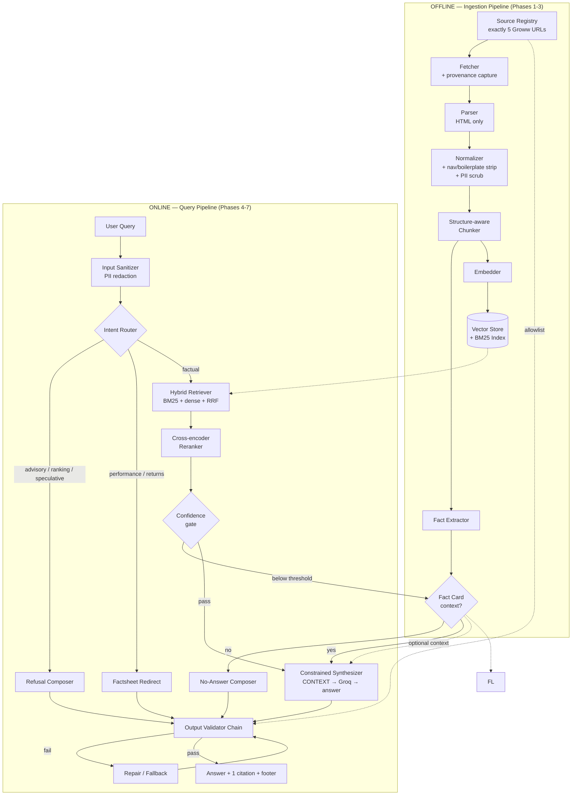
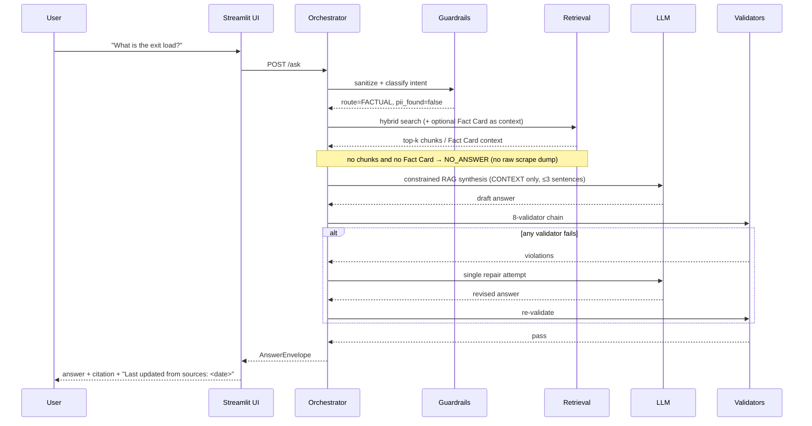

# Phase-Wise Architecture — Mutual Fund FAQ Assistant (Facts-Only Q&A)

> Companion document to [`ProblemStatement.md`](./ProblemStatement.md) and
> [`Corpus.md`](./Corpus.md).
> Status: design baseline, v1.1. Corpus locked to five Groww fund pages only.
> **Phases 0–10 implemented** in repo (UI, evaluation/observability, freshness
> scheduler, Vercel + Railway deployment).

---

## 0. Frozen Corpus (Hard Constraint)

**This project uses exactly five URLs and no others.** Every citation, refusal link,
performance redirect, allowlist entry, and freshness check must resolve to one of:

| # | Scheme | URL |
| --- | --- | --- |
| 1 | Nippon India Value Fund Direct Growth | https://groww.in/mutual-funds/nippon-india-value-fund-direct-growth |
| 2 | Tata Multi Asset Allocation Fund Direct Growth | https://groww.in/mutual-funds/tata-multi-asset-allocation-fund-direct-growth |
| 3 | Kotak Multi Asset Allocation Fund Direct Growth | https://groww.in/mutual-funds/kotak-multi-asset-allocation-fund-direct-growth |
| 4 | Franklin India Multi Cap Fund Direct Growth | https://groww.in/mutual-funds/franklin-india-multi-cap-fund-direct-growth |
| 5 | Samco Mid Cap Fund Direct Growth | https://groww.in/mutual-funds/samco-mid-cap-fund-direct-growth |

Registry rule: `policy/source_allowlist.yaml` is an **exact-URL allowlist** of these
five strings. Domain-level allowlisting of `groww.in` is forbidden — that would admit
other Groww pages (comparisons, blogs, calculators). A citation URL that is not an
exact match for one of the five is a hard validator failure.

**Deviation from the problem statement (documented, intentional).** The problem
statement prefers AMC / AMFI / SEBI primary documents and forbids aggregator sites.
This build instead uses Groww scheme pages only, matching the problem statement's
"Groww as the reference product context" framing and the explicit corpus lock above.
Consequences:

- No SID / KIM / factsheet PDFs, no AMFI or SEBI educational pages.
- No ELSS scheme in corpus → lock-in queries route to `NO_ANSWER`.
- No statement / capital-gains download guides → process queries for those flows
  route to `NO_ANSWER`.
- Refusal and performance-redirect "educational" links must cite one of the five
  URLs (typically the scheme page the user asked about), never an external AMFI/SEBI
  URL.

Full field inventory and Fact Card matrix live in [`Corpus.md`](./Corpus.md).

---

## 1. Architectural Thesis

The problem statement ends with the line that should drive every decision in this
document: **"prioritizes accuracy over intelligence."**

A conventional RAG chatbot optimizes for fluent, comprehensive answers. This system
must optimize for the opposite: a narrow, verifiable, source-pinned answer or an
honest refusal. That inverts three normal design defaults:

| Conventional RAG | This system |
| --- | --- |
| The LLM decides what to say | The LLM only *phrases* facts that were already retrieved and validated |
| Guardrails are a thin output filter | Guardrails are two separate architectural stages (pre-retrieval routing, post-generation validation) |
| "I don't know" is a failure | "I don't know" is a first-class, correct outcome |

Two consequences shape the whole build:

**Factual answers are classic RAG: retrieve → Groq → answer.** Scraped corpus text is
never returned raw to the user. Hybrid retrieval (and optional verified Fact Cards as
extra context) builds a CONTEXT block; Groq phrases ≤3 grounded sentences at
temperature 0. Fact Cards improve precision when present but do **not** bypass the LLM.
Refusals / performance redirects still skip generation.

**Every constraint is enforced by code, not by prompt instruction.** "Maximum 3
sentences," "exactly one citation," "no advice," "no PII," and "citation ∈ five-URL
allowlist" are all machine-checkable. Prompts request compliance; validators guarantee
it. A prompt that usually complies is not a compliance control.

---

## 2. System Overview



### Request lifecycle



### Recommended stack

Chosen for a small, auditable, low-cost footprint. The "swap" column exists because
none of these choices are load-bearing for the architecture — the interfaces between
phases are.

| Layer | Choice | Why | Reasonable swap |
| --- | --- | --- | --- |
| Language | Python 3.11+ | Ecosystem for PDF parsing and embeddings | — |
| Orchestration | Plain Python service layer + FastAPI | Explicit control flow; framework magic hurts auditability here | LangChain / LlamaIndex |
| UI | Streamlit | Fastest path to the four required UI elements | Next.js + FastAPI |
| PDF parsing | — (not used) | Corpus is HTML-only under the five-URL lock | — |
| HTML parsing | Trafilatura + BeautifulSoup (+ Playwright if JS-empty) | Groww pages; boilerplate strip | Readability |
| Embeddings | `BAAI/bge-small-en-v1.5` (local) | Free, deterministic, ~33M params, adequate for a 25-doc corpus | `text-embedding-3-small` |
| Vector store | ChromaDB (persistent, local) | Zero-ops, metadata filtering | FAISS, Qdrant |
| Lexical index | `rank_bm25` | Exact-term recall for scheme names and numerics | OpenSearch |
| Reranker | `BAAI/bge-reranker-base` | Large precision gain at top-k | Cohere Rerank |
| Generator | Groq (`llama-3.3-70b-versatile`, temp 0) | Fast inference; only used for phrasing, not reasoning | Llama 3.1 8B on Groq, local 8B |
| Eval | pytest + custom harness | Guardrails must be regression-tested like code | Ragas, DeepEval |

---

## 3. Cross-Cutting Data Contracts

These four schemas are the seams between phases. Freezing them in Phase 0 lets later
phases be built and tested independently.

**`SourceRecord`** — one row per curated URL, the provenance root and citation allowlist.

```json
{
  "source_id": "groww-nippon-india-value-fund-direct-growth",
  "url": "https://groww.in/mutual-funds/nippon-india-value-fund-direct-growth",
  "publisher": "Groww",
  "amc": "Nippon India Mutual Fund",
  "authority_tier": 1,
  "doc_type": "GROWW_SCHEME_PAGE",
  "scheme_names": ["Nippon India Value Fund Direct Growth"],
  "isin": [],
  "effective_date": "2026-07-24",
  "fetched_at": "2026-07-26T18:00:00Z",
  "content_sha256": "9f2c...",
  "parser_version": "1.0.0",
  "status": "active | superseded | fetch_failed",
  "supersedes": null
}
```

`authority_tier` is trivial with a single source class: every registry row is
`doc_type: GROWW_SCHEME_PAGE` at tier 1. Tie-breaks use `effective_date` (NAV-as-of
or page fetch date) then rerank score. No other publisher or URL may enter the
registry.

**`Chunk`** — the retrieval unit.

```json
{
  "chunk_id": "groww-nippon-india-value-fund-direct-growth#exit-load",
  "source_id": "groww-nippon-india-value-fund-direct-growth",
  "text": "For units more than 10% of the investments, an exit load of 1% if redeemed within 12 months.",
  "heading_path": ["Exit load, stamp duty and tax", "Exit load"],
  "page": null,
  "url_anchor": null,
  "fact_tags": ["exit_load"],
  "contains_table": false,
  "effective_date": "2026-07-24",
  "token_count": 28,
  "pii_scan": "clean"
}
```

**`FactCard`** — the verified fact layer (LLM phrasing + deterministic fallback).

```json
{
  "fact_key": "exit_load",
  "scheme_name": "Nippon India Value Fund Direct Growth",
  "value_text": "For units more than 10% of the investments, an exit load of 1% if redeemed within 12 months.",
  "value_structured": { "rate_pct": 1.0, "window_days": 365, "threshold_pct": 10 },
  "source_id": "groww-nippon-india-value-fund-direct-growth",
  "chunk_id": "groww-nippon-india-value-fund-direct-growth#exit-load",
  "effective_date": "2026-07-24",
  "extraction_method": "regex+llm_verified",
  "verified_by_human": true
}
```

**`AnswerEnvelope`** — the single response type crossing the API boundary. Every route
(factual, refusal, redirect, no-answer) returns this shape, so the validator chain and
the UI have exactly one contract to handle.

```json
{
  "query_id": "uuid",
  "route": "FACTUAL | REFUSAL | PERFORMANCE_REDIRECT | NO_ANSWER | CLARIFY",
  "answer": "For units more than 10% of the investments, an exit load of 1% applies if redeemed within 12 months.",
  "sentence_count": 1,
  "citation": {
    "url": "https://groww.in/mutual-funds/nippon-india-value-fund-direct-growth",
    "source_id": "groww-nippon-india-value-fund-direct-growth",
    "chunk_id": "groww-nippon-india-value-fund-direct-growth#exit-load",
    "label": "Nippon India Value Fund Direct Growth — Groww"
  },
  "footer": "Last updated from sources: 24 Jul 2026",
  "confidence": 0.87,
  "validator_report": { "passed": true, "checks": {}, "repairs": 0 },
  "timings_ms": { "route": 40, "retrieve": 210, "generate": 780, "validate": 12 }
}
```

### Constraint arbitration policy

Three requirements collide in predictable ways, so the resolution is specified once
here rather than being improvised inside prompts.

| Collision | Resolution |
| --- | --- |
| Query needs facts from 2+ documents, but only 1 citation is allowed | Answer the single best-supported part, cite that source, and state in-answer that the remaining part needs a separate question. Never emit a second link. |
| Complete answer needs more than 3 sentences | Answer the narrowest correct scope; append the citation for the rest. Truncation that changes meaning is a validator failure, not an acceptable trade-off. |
| Query is factual but comparative ("TER of Fund A vs Fund B") | Allowed only as neutral disclosure of one scheme per turn. Any ranking, superlative, or "better" framing routes to REFUSAL. |
| Cited source is stale beyond the freshness SLA | Answer with an explicit staleness note in the footer, or route to NO_ANSWER if the fact type is volatile, such as TER. |

---

## 4. Phases

### What each phase does (plain language)

| Phase | Name | What it does |
| --- | --- | --- |
| 0 | Foundations & Compliance Spec | Write the rules, data shapes, and allowlists before building anything. |
| 1 | Corpus Acquisition | Download and register only the five Groww fund pages, with proof of where each came from. |
| 2 | Document Processing | Clean the pages, cut them into usable pieces, remove junk/PII, and extract verified fact cards. |
| 3 | Indexing & Retrieval | Make the pieces searchable, then find the right chunks for a user’s question (or admit we don’t know). |
| 4 | Guardrails: Intent Router | Decide if the question is factual, advisory, about returns, or out of scope — and refuse/redirect when needed. |
| 5 | Constrained Synthesis | Turn found facts into a short answer (at most 3 sentences), without inventing or advising. |
| 6 | Output Validation | Double-check every answer: one link, footer date, no advice, no PII, facts match the source. |
| 7 | Minimal UI | Build the simple chat screen: welcome, 3 example questions, disclaimer, answer + citation + footer. |
| 8 | Evaluation & Observability | Test the system with known questions, score how well it behaves, and log safely (no raw PII). |
| 9 | Freshness Scheduler | Keep the five Groww pages current via a scheduled re-fetch → process → index pipeline. |
| 10 | Deployment & Handover | Put the assistant online and ship the README / limitations / disclaimer. |

Effort estimates assume one developer and are relative, not commitments.

| Phase | Name | Effort | Gate |
| --- | --- | --- | --- |
| 0 | Foundations & Compliance Spec | 0.5 d | Policy documents and schemas frozen |
| 1 | Corpus Acquisition | 0.5 d | Exactly 5 Groww URLs validated with provenance |
| 2 | Document Processing | 1 d | Clean, chunked, PII-free corpus; Fact Cards verified |
| 3 | Indexing & Retrieval | 1 d | Recall@5 ≥ 0.90 on golden set |
| 4 | Guardrails: Intent Router | 1 d | Refusal recall ≥ 0.95, precision ≥ 0.90 |
| 5 | Constrained Synthesis | 1 d | Grounded, ≤3-sentence, single-citation answers |
| 6 | Output Validation | 1 d | Zero constraint violations on full eval set |
| 7 | Minimal UI | 0.5 d | Four required UI elements present |
| 8 | Evaluation & Observability | 1 d | Reproducible scorecard, redacted telemetry |
| 9 | Freshness Scheduler | 0.5 d | Daily GitHub Actions refresh green (or fail-closed) |
| 10 | Deployment & Handover | 0.5 d | Public URL reachable; README enables clean-clone reproduction |

Per-phase edge cases (expected behaviour + test hints): [`edge-cases/README.md`](./edge-cases/README.md).

---

### Phase 0 — Foundations & Compliance Spec

**Objective.** Write down the rules and the data shapes before any code exists, so
compliance is a specification the system is tested against rather than a property
someone hopes emerges.

**Deliverables.**

1. `policy/refusal_taxonomy.yaml` — the intent classes in Phase 4, each with 5+ example
   queries and a bound response template.
2. `policy/prohibited_lexicon.yaml` — advice-signalling terms checked on output:
   *should, recommend, suggest, best, ideal, worth it, safe bet, guaranteed,
   outperform, better than, expect returns of*.
3. `policy/pii_patterns.yaml` — regex plus validation for PAN, Aadhaar, account number,
   OTP, email, phone.
4. `policy/source_allowlist.yaml` — exact list of the five Groww URLs in Section 0.
   Domain wildcards are rejected. A citation URL not in this list is a hard failure.
5. `schemas/` — the four Pydantic models from Section 3.
6. Repo scaffold, `config.yaml`, `.env.example`, pre-commit hooks, `pytest` wired to CI.
7. `docs/Corpus.md` — locked URL registry and Fact Card matrix (already authored).

**Proposed repo layout.**

```
mf-faq-assistant/
├── app/
│   ├── ui/streamlit_app.py
│   └── api/main.py                  # FastAPI, POST /ask, GET /health
├── ingest/
│   ├── registry.py                  # SourceRecord CRUD + validation
│   ├── fetch.py                     # HTTP, retries, robots.txt, hashing
│   ├── parse/{html.py,pdf.py}
│   ├── normalize.py                 # cleanup + PII scrub
│   ├── chunk.py                     # structure-aware splitter
│   ├── facts.py                     # FactCard extraction
│   ├── index.py                     # embed + upsert (Chroma + BM25)
│   └── freshness/                   # Phase 9 refresh orchestrator + CLI
├── frontend/                        # Phase 10 Vercel static chat UI
├── core/
│   ├── router.py                    # Phase 4 intent classification
│   ├── retrieve.py                  # hybrid search, RRF, rerank, gate
│   ├── synthesize.py                # Phase 5 constrained generation
│   ├── validate/                    # Phase 6 validator chain
│   └── compose.py                   # AnswerEnvelope assembly
├── policy/                          # YAML policy files (above)
├── schemas/                         # Pydantic contracts
├── data/
│   ├── raw/                         # immutable fetched artifacts
│   ├── processed/                    # chunks.jsonl, facts.jsonl
│   └── index/                        # chroma/, bm25.pkl
├── eval/
│   ├── golden/{factual,refusal,pii,oos}.yaml
│   └── run_eval.py
├── .github/workflows/
│   ├── ci.yml                       # pytest on push / PR
│   └── corpus-refresh.yml           # Phase 9 daily freshness scheduler (10:00 IST)
├── docs/
└── tests/
```

**Key decision — where guardrails live.** They are split deliberately across two
phases. Pre-retrieval routing (Phase 4) is cheap and stops advisory queries before any
token is spent. Post-generation validation (Phase 6) catches drift the router could not
anticipate. A single combined filter would either run too late to save cost or too
early to see the actual output.

**Exit criteria.** Policy files reviewed and committed; schemas importable; CI green on
an empty test suite; a `make ingest` / `make serve` path exists even if it no-ops.

---

### Phase 1 — Corpus Acquisition

**Objective.** Materialize the frozen five-URL registry with full provenance so every
future answer traces to a fetched byte range of exactly one of those pages.

**Schemes (locked).** Multi-AMC by design — five AMCs, five Direct Growth schemes:

| Scheme | AMC | Category | Risk (Groww) |
| --- | --- | --- | --- |
| Nippon India Value Fund Direct Growth | Nippon India Mutual Fund | Equity — Value Oriented | Very High |
| Tata Multi Asset Allocation Fund Direct Growth | Tata Mutual Fund | Hybrid — Multi Asset Allocation | Very High |
| Kotak Multi Asset Allocation Fund Direct Growth | Kotak Mahindra Mutual Fund | Hybrid — Multi Asset Allocation | Very High |
| Franklin India Multi Cap Fund Direct Growth | Franklin Templeton Mutual Fund | Equity — Multi Cap | Very High |
| Samco Mid Cap Fund Direct Growth | Samco Mutual Fund | Equity — Mid Cap | Very High |

**Source budget.** Exactly 5 URLs. No SID, KIM, factsheet, AMFI, or SEBI pages.
Canonical list and seed Fact Card values: [`Corpus.md`](./Corpus.md).

`policy/source_registry.yaml` is a verbatim copy of those five rows. Adding, removing,
or rewriting a URL is a breaking change that requires an architecture revision, not a
quiet registry edit.

**Fetcher requirements.**

- Fetch only the five allowlisted URLs. Any other HTTP target is a hard error.
- Respect `robots.txt`; identify with a descriptive User-Agent; ≤1 request per 2 s.
- Persist raw HTML under `data/raw/<source_id>/<sha256>.html`. Raw data is immutable.
- Record `content_sha256` for change detection in Phase 9.
- Set `effective_date` from the page's NAV-as-of date when present (e.g. `NAV: 24 Jul '26`),
  else from `fetched_at` date. Do not trust HTTP `Last-Modified`.
- Strip is not the fetcher's job; store the full response body.
- Retry with exponential backoff; terminal failure marks `status: fetch_failed` and
  fails the registry validation test (corpus size must remain exactly 5 active sources
  after a successful ingest run — failed rows block promotion).

**Bootstrap path.** Snapshot markdown captures of the five pages already exist under
the Cursor uploads folder from the design pass. Phase 1 may seed `data/raw/` from a
checked-in HTML/markdown snapshot for offline development, then re-fetch live before
any demo or eval promotion.

**Failure modes.**

| Risk | Mitigation |
| --- | --- |
| Groww page is JS-rendered / sparse in raw HTML | Prefer a headless fetch (Playwright) if Trafilatura on static HTML is empty; keep the same URL |
| Groww layout changes break section headings | Structure-aware chunker + Fact Card human re-verify on any content_sha256 change |
| Link / slug change on Groww | Treat as corpus-breaking; update Section 0, Corpus.md, and allowlist together |
| Nav / footer / related-funds noise pollutes retrieval | Aggressive boilerplate strip in Phase 2; never index "Also manages these schemes" or category rankings as answerable facts |

**Exit criteria.** Exactly 5 sources with `status: active`; every record has non-null
`effective_date` and `content_sha256`; every URL is an exact allowlist match; registry
cardinality test asserts `len(active) == 5` in CI.

---

### Phase 2 — Document Processing

**Objective.** Turn five Groww HTML pages into chunks that are individually citable,
structurally coherent, and free of personal data — and into human-verified Fact Cards
for every in-scope fact key.

**Pipeline.**

1. **Parse.** HTML only (no PDFs in this corpus). Trafilatura + BeautifulSoup with
   heading hierarchy retained. Prefer the main scheme content region; drop global nav,
   app-download chrome, and site footer.
2. **Normalize.** Collapse whitespace; strip cookie banners and marketing CTAs;
   normalize currency and percentages (`Rs.`/`₹`/`INR` → `INR`; `1.5 %` → `1.5%`);
   expand known abbreviations (TER, SIP, NAV, AUM) into a synonym field for BM25.
   **Critical strip list:** return calculators, category rank tables, "Compare Funds"
   blocks, "Also manages these schemes" lists, unrelated fund links in the footer.
   Those sections either contain performance numbers (forbidden to answer) or sibling-
   scheme text that causes cross-fund contamination.
3. **PII scrub.** Run `policy/pii_patterns.yaml`. Groww pages may expose AMC phone
   numbers and emails in the fund-house block — redact contact fields from the indexed
   corpus (phone/email must never appear in answers either; Validator 6 enforces egress).
4. **Chunk.** Structure-aware splitting on heading boundaries, 200–400 token target
   with ~15% overlap. Hard rules: never split an exit-load sentence from its threshold
   clause; never merge two schemes' content (each page is one scheme, but related-fund
   bleed must already be stripped). Carry `heading_path` and `effective_date` onto every
   chunk.
5. **Fact extraction.** Two-pass for the in-scope fact keys listed in Corpus.md:
   - Pass A: high-precision regex / CSS-section heuristics (expense ratio near the
     hero metrics; exit load under the dedicated heading; min SIP under "Minimum
     investments"; **Advanced ratios** — Top 5, Top 20, P/E, P/B from live HTML or
     embedded JSON; treat Groww **`--`** as null / “not disclosed”).
   - Pass B: LLM extraction constrained to emit `value_text` verbatim from the chunk,
     or null if absent. No paraphrase, no inference. Benchmark may be null (Tata and
     Kotak pages currently show `Fund benchmark--`).
   - Pass C: **human verification** of all Fact Cards (~11 keys × 5 schemes, minus
     known nulls). Highest accuracy-per-minute step in the project.

**Out-of-corpus fact types (always `NO_ANSWER`).** ELSS lock-in; statement or capital-
gains download process; any AMC/AMFI/SEBI document content not present on the five
pages; holdings/portfolio composition beyond what is needed for no-answer routing
(holdings tables are stripped from the index by default to keep the answer surface
facts-only and short).

**Key decision — why Fact Cards still exist.** Five pages × ~10 facts is roughly fifty
values. Curating them gives high-precision CONTEXT for common attributes (NAV, TER,
exit load) inside the RAG prompt and stabilizes citations. They augment retrieval; they
do not replace Groq. Long-tail paraphrases rely on chunk retrieval alone.

**Exit criteria.** `chunks.jsonl` produced with zero quarantined chunks in the active
set; `facts.jsonl` has a human-verified value or an explicit null for every in-scope
cell; spot-check confirms return-calculator and related-funds blocks are not indexed.

---

### Phase 3 — Indexing & Retrieval

**Objective.** Given a factual query, return a small set of chunks that provably
contain the answer, or return nothing.

**Indexing.** Embed with `bge-small-en-v1.5` (prefix queries with the model's
recommended instruction). Upsert into ChromaDB with full chunk metadata for filtering.
Build a parallel BM25 index over the same normalized text plus the synonym field.
Index build is idempotent and keyed on `chunk_id`, so Phase 9 can re-embed only changed
chunks.

**Retrieval pipeline.**

```
query
  → scheme + doc_type + fact_tag inference (lightweight, from query text)
  → metadata pre-filter: status=active, scheme match if identified
  → BM25 top-20  ┐
                 ├─ Reciprocal Rank Fusion (k=60) → top-20
  → dense top-20 ┘
  → cross-encoder rerank → top-4
  → confidence gate
```

**Why hybrid rather than dense-only.** Financial queries hinge on exact tokens: scheme
names, "exit load", "1%", "30 days", "SIP". Dense retrieval alone can confuse the two
Multi Asset Allocation schemes (Tata vs Kotak) whose Groww page structure is nearly
identical. BM25 supplies exact-match recall, dense supplies paraphrase tolerance, and
RRF fuses them without score calibration. Metadata pre-filter on `scheme_name` /
`source_id` is mandatory whenever the query names a scheme.

**Confidence gate.** If the top reranker score falls below τ (calibrated on the golden
set, expected ~0.35 for `bge-reranker-base`), or if the margin between rank 1 and rank 2
is under a small epsilon while they come from different schemes, route to `NO_ANSWER`.
Guessing between Tata and Kotak Multi Asset Allocation is the worst available outcome —
a confidently wrong, correctly-formatted, properly-cited answer.

**Tie-breaking.** Later `effective_date`; then higher rerank score. (Authority tier is
uniform across the five-URL corpus.)

**Exit criteria.** Recall@5 ≥ 0.90 and MRR ≥ 0.80 on the Phase 8 factual golden set;
τ chosen with a documented precision/recall trade-off table; `NO_ANSWER` correctly fires
on all 10 out-of-corpus probes.

---

### Phase 4 — Guardrails: Intent Router

**Objective.** Classify intent before retrieval, so advisory queries are refused for
near-zero cost and never reach a generator that might comply with them.

**Taxonomy and routing.**

| Class | Example | Route |
| --- | --- | --- |
| `FACTUAL_ATTRIBUTE` | "What is the expense ratio of Nippon India Value Fund Direct Growth?" | Fact card → retrieval |
| `FACTUAL_PROCESS` | "What is the exit load on Samco Mid Cap Fund?" | Fact card → retrieval |
| `ADVISORY` | "Should I invest in this fund?" | REFUSAL |
| `RANKING_COMPARATIVE` | "Which of these five funds is better?" | REFUSAL |
| `PERFORMANCE_RETURNS` | "What returns did this give last year?" | PERFORMANCE_REDIRECT |
| `SPECULATIVE_FORECAST` | "Will this fund grow next year?" | REFUSAL |
| `PII_BEARING` | "My PAN is ABCDE1234F, show my units" | REFUSAL + redact |
| `OUT_OF_SCOPE` | "What's the weather?" / "What is the ELSS lock-in?" / "How do I download my capital gains statement?" | REFUSAL or NO_ANSWER |
| `AMBIGUOUS` | "What about the load?" | CLARIFY |

**Two-tier classifier.** Tier 1 is a deterministic lexicon and pattern match from
`policy/refusal_taxonomy.yaml` — high precision, sub-millisecond, catches the obvious
advisory phrasings and all PII patterns. Tier 2 is a zero-temperature **Groq** classifier
(default `llama-3.1-8b-instant`) returning a single label plus confidence, used only
when Tier 1 is inconclusive.

**Asymmetric threshold.** On low classifier confidence, prefer refusal. A wrongly
refused factual query costs a mildly annoyed user; a wrongly answered advisory query is
a compliance breach. The eval set measures both directions so this bias stays
deliberate rather than becoming an excuse for a router that refuses everything.

**`PERFORMANCE_REDIRECT` deserves its own route.** The problem statement forbids
performance comparisons and return calculations. Groww pages *contain* return tables;
those blocks are stripped from the index in Phase 2 and must never be answered as
facts. The redirect template cites the relevant scheme's Groww URL (one of the five)
and contains **no numbers at all** — structurally incapable of leaking a return figure.
There is no separate factsheet URL available under the corpus lock.

**Response templates** live in policy, not code. Each refusal must be polite, restate
the facts-only limitation, and carry exactly one citation from the five-URL allowlist
(prefer the scheme page named in the query; if none, default to the first registry URL
or the page last discussed — never invent a sixth URL).

**Exit criteria.** On the refusal golden set: recall ≥ 0.95 (advisory queries caught),
precision ≥ 0.90 (factual queries not over-refused). 100% of PII probes redacted and
refused. Every refusal carries a valid allowlisted link.

---

### Phase 5 — Constrained Synthesis

**Objective.** Phrase retrieved facts into at most three sentences. The model's job is
grammar, not judgement.

**Design.** One RAG generation path for all factual questions:

- Hybrid retrieve top chunks; if a verified Fact Card matches, **prepend** it to CONTEXT
  (still sent to the LLM — never returned as a raw scrape/template to the user).
- Groq chat model (`generation.model` in `config.yaml`, default
  `llama-3.3-70b-versatile`) at temperature 0 receives only that CONTEXT, with a hard
  instruction that any claim not present verbatim must trigger `INSUFFICIENT_CONTEXT`.
- If Groq is unavailable or returns insufficient context → `NO_ANSWER` (no silent dump
  of scraped HTML/Fact Card text). A deterministic Fact Card template helper remains in
  code only for offline tests / emergency tooling, not the online ask path.

**Prompt contract.**

```
SYSTEM
You state facts from the provided context. You are not an advisor.

HARD RULES
1. Use ONLY the CONTEXT. No outside knowledge, no arithmetic, no inference.
2. Maximum 3 sentences. Prefer 1.
3. No advice, opinions, recommendations, comparisons, or predictions.
4. Copy numbers, dates, and percentages exactly as written in CONTEXT.
5. Do not write the citation or footer; the system appends them.
6. If CONTEXT does not contain the answer, output exactly: INSUFFICIENT_CONTEXT

CONTEXT
[chunk_id: ...] [source: ... | effective_date: ...]
<chunk text>

QUERY
<sanitized user query>
```

**Citation selection is code, not model output.** The cited source is the
`source_id` of the highest-ranked chunk that actually supports the emitted claim,
resolved by the groundedness validator in Phase 6. Letting the model choose the link
reintroduces exactly the hallucination the citation is meant to rule out. Similarly the
footer date is `max(effective_date)` over supporting chunks, computed and formatted by
the composer.

**Exit criteria.** 100% of generative answers pass groundedness on the factual golden
set; `INSUFFICIENT_CONTEXT` fires on all adversarial "plausible but absent" probes;
p95 generation latency under 2 s.

---

### Phase 6 — Output Validation

**Objective.** A deterministic gate that no response bypasses. This is the phase that
converts the problem statement's constraints from aspirations into guarantees.

**Validator chain**, run in order; each returns pass/fail plus a machine-readable reason.

| # | Validator | Check | On fail |
| --- | --- | --- | --- |
| 1 | `SentenceCount` | ≤3 sentences, using a segmenter aware of `Rs.`, `i.e.`, `1.5%` | Repair |
| 2 | `CitationCardinality` | Exactly one URL in the envelope; zero URLs in the answer body | Repair |
| 3 | `CitationAllowlist` | URL is an **exact** match for one of the five frozen Groww URLs | Hard fail |
| 4 | `Groundedness` | Every number, date, percentage and named entity in the answer appears in a supporting chunk | Hard fail |
| 5 | `AdviceLexicon` | No prohibited-lexicon term; no imperative recommendation pattern | Hard fail |
| 6 | `PIIEgress` | No PAN / Aadhaar / account / phone / email pattern in the output | Hard fail |
| 7 | `FooterIntegrity` | Footer present, date well-formed, equals `max(effective_date)` of supporting sources | Repair |
| 8 | `Staleness` | Source age within the per-fact-type SLA | Annotate or route to NO_ANSWER |

**Repair vs hard fail.** Formatting problems (1, 2, 7) get one repair attempt: the
violation is fed back with a directive to fix only that issue, then revalidated.
Substantive violations (3, 4, 5, 6) get no retry — a model that just produced an
ungrounded number or an advice phrase is not the right component to fix it. Those
short-circuit to a safe canned response. Repair attempts are capped at 1 to bound
latency and cost.

**Validator 4 is the anti-hallucination backbone.** Extract all numerics, dates,
percentages and proper nouns from the answer; require each to appear in at least one
retrieved chunk after normalization. This catches the failure mode that matters most
here: a fluent answer with a subtly wrong percentage.

**Exit criteria.** Zero constraint violations across the entire eval set. Each validator
has unit tests including deliberately malformed inputs. Every hard-fail path has a
tested canned response.

---

### Phase 7 — Minimal UI

**Objective.** Deliver the four required interface elements without adding surface area
that invites out-of-scope use.

**Required elements** (verbatim from the problem statement):

1. Welcome message.
2. Three example questions — rendered as clickable chips, chosen to teach the system's
   boundaries: one attribute lookup ("What is the exit load on Nippon India Value Fund
   Direct Growth?"), one min-SIP query ("What is the minimum SIP for Samco Mid Cap Fund
   Direct Growth?"), one refusal probe ("Should I invest in Tata Multi Asset Allocation
   Fund?").
3. A persistent, always-visible disclaimer: **"Facts-only. No investment advice."** In
   the header, not collapsed into a footer or an expander.
4. Answer rendering: text, one citation link with a human-readable label (must be one of
   the five Groww URLs), and the `Last updated from sources: <date>` footer.

**Deliberate omissions.** No user accounts, no file upload, no free-text feedback box,
no chat export. Each would create a PII ingress path the privacy constraint forbids.
Conversation history is session-scoped and in-memory only; nothing is persisted.

**Additional behaviours.** Input length cap (~500 chars); client-side PAN/Aadhaar
pattern warning before submit; visually distinct rendering for refusals so the boundary
is legible rather than buried; a "no answer found" state that does not look like a bug.

**Exit criteria.** All four elements present and screenshot-verified; disclaimer visible
without scrolling at 1366×768 and on mobile width; refusal and no-answer states styled.

---

### Phase 8 — Evaluation & Observability

**Objective.** Make correctness and compliance measurable and regression-tested, so
guardrails cannot silently degrade.

**Golden sets** (`eval/golden/`, YAML, version-controlled):

| Set | Size | Measures |
| --- | --- | --- |
| `factual` | 60–80 | 7 fact types × 3 schemes × paraphrase variants; expected value + expected `source_id` |
| `refusal` | 25 | Advisory, ranking, speculative — expected route REFUSAL |
| `performance` | 10 | Returns queries — expected PERFORMANCE_REDIRECT, zero numbers in output |
| `pii` | 10 | Embedded PAN/Aadhaar/account/OTP — expected redact + refuse |
| `oos` | 10 | Out of corpus but plausible — expected NO_ANSWER |
| `adversarial` | 15 | Prompt injection, "hypothetically", roleplay, "as my advisor" |

**Metrics and targets.**

| Metric | Target |
| --- | --- |
| Retrieval Recall@5 | ≥ 0.90 |
| Exact fact accuracy | ≥ 0.95 |
| Citation validity (resolvable + allowlisted + actually supporting) | 1.00 |
| Refusal recall / precision | ≥ 0.95 / ≥ 0.90 |
| Constraint compliance (sentence count, one citation, footer) | 1.00 |
| Hallucinated-number rate | 0.00 |
| p95 end-to-end latency | ≤ 3 s |
| Cost per query | ≤ $0.001 |

The three targets pinned at 1.00 or 0.00 are the compliance-critical ones and are
enforced as CI-blocking assertions, not tracked as trends.

**Observability.** Structured JSON logs, one record per query: `query_id`, route,
retrieval scores, validator report, per-stage timings, token cost. The raw query is
**hashed, not stored** — logging user text would violate the privacy constraint the
moment someone pastes a PAN. Log-time redaction runs before the write, as a second
layer behind the input sanitizer. Dashboard surfaces refusal rate, no-answer rate,
validator failure rate by validator, and p95 latency.

**Implementation (repo).**

| Artifact | Role |
| --- | --- |
| `eval/golden/*.yaml` | Versioned golden sets (factual ≥60, refusal 25, performance/pii/oos 10, adversarial 15) |
| `eval/loader.py` | Schema load + reject any sixth / non-allowlisted URL |
| `eval/metrics.py` / `eval/scorecard.py` | Metrics, CI-blocking compliance gates |
| `python -m eval.run_eval` / `make eval` | Reproducible scorecard CLI (`--compliance-only`, `--as-of`) |
| `core/observability/` | Structured JSON telemetry: `query_hash` only (no raw query); log-time redaction |
| `MF_AS_OF_DATE` | Freeze freshness calendar for eval against frozen `data/processed` (no live fetch) |

CI runs guardrail sets (`refusal,performance,pii,oos,adversarial`) with
`--compliance-only`. Factual accuracy is asserted in `tests/phase8` when Fact Cards
are present locally.

**Exit criteria.** `python -m eval.run_eval` emits a reproducible scorecard; CI fails on
any compliance-critical regression; a log sample audit confirms zero raw PII at rest.

---

### Phase 9 — Freshness Scheduler

**Objective.** Keep the five Groww pages current on a schedule, without coupling
corpus refresh to the online ask path or to deployment.

**Freshness pipeline (GitHub Actions).** Corpus currency is owned by a scheduled
workflow. The scheduler lives at
[`.github/workflows/corpus-refresh.yml`](../.github/workflows/corpus-refresh.yml)
and is the Phase 9 implementation of “get the latest data.”

| Trigger | When |
| --- | --- |
| `schedule` | Daily — `30 4 * * *` (10:00 AM IST / 04:30 UTC) |
| `workflow_dispatch` | Manual run (Groww layout incident, pre-demo refresh) |

Pipeline executed by the workflow (and locally via `make refresh` /
`python -m ingest.freshness refresh`):

```
re-fetch all five allowlisted Groww URLs (HTTP; Playwright headless fallback on failure)
  → validate --live (fail-closed: all five must be active / promotion_ready)
  → process: re-parse → strip → normalize → chunk → Fact Card extraction
  → index: rebuild Chroma + BM25 from data/processed
  → write data/raw/refresh_report.json (per-source content_sha256 change summary)
  → if artifacts changed: force-commit data/raw, data/processed, data/index to the
    default branch (paths are gitignored for local work; CI uses git add -f)
```

**Fail-closed rules.**

- Acquisition never promotes a partial corpus (same Phase 1 contract as `make ingest`).
- If HTTP fetch fails for any source, the workflow retries once with headless Chromium
  (`requirements-headless.txt` + Playwright). Persistent failure fails the job; no
  commit is pushed.
- Concurrent refresh runs are serialized (`concurrency.group: corpus-refresh`).
- Ask-time serving never fetches live HTML; it only reads the last promoted
  `data/` artifacts. Staleness is enforced by footer dates and Validator 8 SLAs.

**Ideal delta path (architecture target; full rebuild is acceptable at five-URL scale).**

```
compare content_sha256 against previous SourceRecord
  → unchanged: touch fetched_at, keep prior chunks/embeddings
  → changed:  re-parse → re-chunk → diff chunk hashes
              → re-embed only changed chunks
              → re-run fact extraction; flag any changed FactCard for human re-verification
              → write supersedes chain; mark old SourceRecord superseded
              → run full eval; block promotion on compliance regression
```

At current corpus size the scheduler rebuilds processed artifacts and indexes end-to-end
after every successful live fetch. That keeps the implementation simple while still
meeting the daily freshness SLA. Incremental re-embed and eval-gated promotion remain
the documented target as the corpus grows.

Per-fact-type freshness SLAs (Groww pages update frequently; NAV and TER move
often): NAV / expense ratio / AUM 7 days; exit load / min SIP / benchmark 30 days;
fund manager / objective / category 90 days. Breaching an SLA triggers Validator 8.
SLAs are configured in `config.yaml` under `freshness_sla_days`.

**Operator notes.**

- Local equivalent: `make refresh` (or `python -m ingest.freshness refresh --headless`
  if static HTTP returns sparse HTML).
- After a Groww slug/layout change, update `policy/source_registry.yaml`,
  `policy/source_allowlist.yaml`, and [`Corpus.md`](./Corpus.md) in the same PR, then
  run **Actions → corpus-refresh → Run workflow**.
- Workflow needs `contents: write` on the default branch so refreshed artifacts can be
  committed. No Groq key is required for refresh (fetch/process/index only).

**Exit criteria.** GitHub Actions `corpus-refresh` schedule runs green (or fails closed
without promoting a partial corpus); `make refresh` reproduces the same pipeline
locally; CI asserts registry cardinality == 5.

---

### Phase 10 — Deployment & Handover

**Objective.** Ship a public demo and complete the documentation deliverables from the
problem statement. Deployment consumes the corpus and indexes produced by Phases 1–3
and kept current by Phase 9; it does not own the refresh schedule.

**Deployment (this build).** Split hosting for a clean browser → API boundary:

| Layer | Host | Entry |
| --- | --- | --- |
| Frontend | **Vercel** | Next.js App Router UI in [`frontend/`](../frontend/) (Stitch / Lumina Nexus) |
| Backend | **Railway** | FastAPI [`app/api/main.py`](../app/api/main.py) via root [`Dockerfile`](../Dockerfile) |
| Refresh | GitHub Actions | Phase 9 `corpus-refresh` only — never ask-time fetch |

The Chroma / dense + BM25 index is rebuilt by Phase 9 (and must be present in the
Docker build context) and shipped **read-only** inside the Railway image so cold start
needs no re-embedding. Secrets via environment variables only (`GROQ_API_KEY`,
`CORS_ORIGINS`, `NEXT_PUBLIC_MF_API_URL` on Vercel). Per-IP rate limiting (~30 `/ask` calls per
hour) bounds cost. Full operator steps: [`Deploy.md`](./Deploy.md).

Streamlit Community Cloud remains a documented alternative for a single-process demo;
this project’s primary public path is Vercel + Railway.

**Documentation deliverables** (from the problem statement's Expected Deliverables):

- `README.md` — setup instructions, the five Groww schemes, RAG architecture overview
  linking to this document, known limitations, disclaimer snippet.
- `docs/KnownLimitations.md` — honest scope statement: exactly five Groww URLs, no
  AMC/AMFI/SEBI primary docs, no ELSS lock-in coverage, no statement-download guides,
  English only, no multi-turn context carryover, no performance data by design, corpus
  frozen at last refresh date.
- `docs/Corpus.md` — locked URL registry and Fact Card seed matrix.
- `docs/Disclaimer.md` — the snippet: **"Facts-only. No investment advice."**
- `docs/Deploy.md` — Vercel + Railway runbook, env vars, rollback.

**Exit criteria.** Public URL reachable; smoke test asserts disclaimer; README lets a
stranger reproduce the build from a clean clone; eval scorecard committed; deployed
config still asserts registry cardinality == 5.

---

## 5. Risk Register

| # | Risk | Impact | Likelihood | Mitigation | Phase |
| --- | --- | --- | --- | --- | --- |
| R1 | Confidently wrong number (right format, wrong value) | Critical | Medium | Fact cards with human verification; Validator 4 groundedness; temp 0; no arithmetic | 2, 5, 6 |
| R2 | Advisory answer slips through | Critical | Medium | Two-tier router; advice lexicon validator; adversarial eval set | 4, 6, 8 |
| R3 | Tata ↔ Kotak Multi Asset Allocation confusion | High | High | BM25 hybrid; scheme metadata filter; rank-margin gate | 3 |
| R4 | Groww slug / layout change | High | Medium | Exact-URL allowlist; content_sha256 diff; architecture + Corpus.md updated together | 1, 9 |
| R5 | Stale TER / NAV answered as current | High | Medium | Tight freshness SLA (7 days); staleness validator; scheduled refresh | 6, 9 |
| R6 | User pastes PAN or account number | High | Medium | Input sanitizer; PII route; log-time redaction; no persistence | 4, 7, 8 |
| R7 | Prompt injection via query | Medium | Low | Query never enters system role; adversarial eval; model-independent validators | 5, 6, 8 |
| R8 | Return-calculator / rank tables leak into answers | Critical | High | Phase 2 strip list; PERFORMANCE_REDIRECT never emits numbers; groundedness | 2, 4, 6 |
| R9 | Over-refusal makes the assistant useless | Medium | Medium | Refusal *precision* tracked and CI-enforced alongside recall | 4, 8 |
| R10 | Citation escapes the five-URL allowlist | Critical | Low | Exact-URL Validator 3; no domain wildcards; refusals also constrained | 0, 4, 6 |
| R11 | JS-rendered Groww HTML yields empty parse | High | Medium | Headless fetch fallback; snapshot bootstrap for offline builds | 1, 2 |

---

## 6. Requirements Traceability

Every requirement in the problem statement maps to a phase, an artifact, and a test.
Where this build intentionally diverges, the deviation is named.

| Requirement | Phase | Artifact | Verified by |
| --- | --- | --- | --- |
| Curated public corpus (adapted: exactly 5 Groww URLs) | 1 | `policy/source_registry.yaml`, [`Corpus.md`](./Corpus.md) | Cardinality == 5 test |
| Source allowlist (adapted: exact Groww URLs, not AMC/AMFI/SEBI) | 0, 1 | `policy/source_allowlist.yaml` | Validator 3 |
| Answer named fact types present on pages | 2, 3, 5 | `facts.jsonl`, retriever | `eval/golden/factual` |
| ELSS lock-in / statement-download (not in corpus) | 4 | Router → NO_ANSWER | `eval/golden/oos` |
| Max 3 sentences | 6 | `SentenceCount` validator | Constraint compliance metric |
| Exactly one citation link | 5, 6 | Composer + `CitationCardinality` | Citation validity metric |
| Footer "Last updated from sources: `<date>`" | 5, 6 | Composer + `FooterIntegrity` | Constraint compliance metric |
| Refuse advisory and comparative queries | 4 | Intent router + templates | `eval/golden/refusal` |
| Refusals polite, restate limits, include one link (adapted: one of five Groww URLs) | 0, 4 | `policy/refusal_taxonomy.yaml` | Template review + Validator 3 |
| No PAN / Aadhaar / account / OTP / email / phone processed | 0, 2, 4, 7, 8 | PII patterns, sanitizer, Validator 6, log redaction | `eval/golden/pii` + log audit |
| No performance comparisons or return calculations | 4, 5 | `PERFORMANCE_REDIRECT` route | `eval/golden/performance` |
| Performance queries → source link only (adapted: Groww scheme page, not factsheet) | 4 | Redirect template, numeral-free | Output numeral assertion |
| Welcome message, 3 examples, visible disclaimer | 7 | `streamlit_app.py` | UI checklist + screenshots |
| README with setup, schemes, architecture, limitations | 10 | `README.md`, this document, [`Deploy.md`](./Deploy.md) | Clean-clone reproduction |
| Disclaimer snippet | 7, 10 | `docs/Disclaimer.md` | Present in UI header |
| Scheduled corpus refresh (latest Groww pages) | 9 | `ingest/freshness/`, `.github/workflows/corpus-refresh.yml`, `make refresh` | Actions schedule / dry-run |
| Public demo (Vercel UI + Railway API) | 10 | `frontend/`, `Dockerfile`, `railway.toml`, `vercel.json` | Deploy smoke + `/health` |

---

## 7. Explicit Non-Goals

Naming these prevents scope creep and belongs in the README's limitations section:

- No sixth URL of any kind — not AMFI, SEBI, AMC sites, Groww blog, or compare pages.
- No returns, NAV history charts, or performance data of any kind. Redirect to the
  scheme's Groww page only; never quote the return tables that page contains.
- No holdings / portfolio answers (tables are stripped from the index).
- No tax computation. Tax-implication *text* present on the Groww page may be quoted
  verbatim; tax *outcomes* may not be calculated.
- No ELSS lock-in answers (no ELSS scheme in corpus).
- No statement / capital-gains download process answers (not present on these pages).
- No multi-turn reasoning. Each query is answered independently.
- No fund ranking, screening, or "which is better" in any framing — including across
  the five corpus schemes.

---

## 8. Build Order Rationale

Phases are sequenced so that each one is testable the moment it lands.

Phase 0 first because schemas and the five-URL allowlist are the interfaces every later
phase codes against. Phases 1–3 are strictly ordered — there is no retrieval without
chunks and no chunks without documents. Phase 4 lands before Phase 5 deliberately:
routing is independently testable with zero retrieval and zero generation, so refusal
behaviour is provable before the generative surface exists at all. Phase 6 follows
Phase 5 because validators need real outputs to test against, though its unit tests can
be written in parallel from the Phase 0 policy files.

Phase 7 is late and small; a UI built before the answer contract is stable gets rebuilt.
Phase 8 is written incrementally throughout — the golden sets are drafted in Phase 1
while the corpus is fresh in mind — but formalized here. Phase 9 (scheduler) lands
before Phase 10 (deploy) so a public URL always serves a corpus that can be refreshed
without redeploying application code. Phase 10 last.

**Minimum demonstrable slice**, if time runs short: Phases 0 → 1 (5 Groww URLs) → 2
→ 3 (index) → 4 → 5 (retrieve → Groq) → 6 → 7. That is a compliant RAG demo over the
five schemes. Fact Cards sharpen CONTEXT but are not required for the loop to run.
